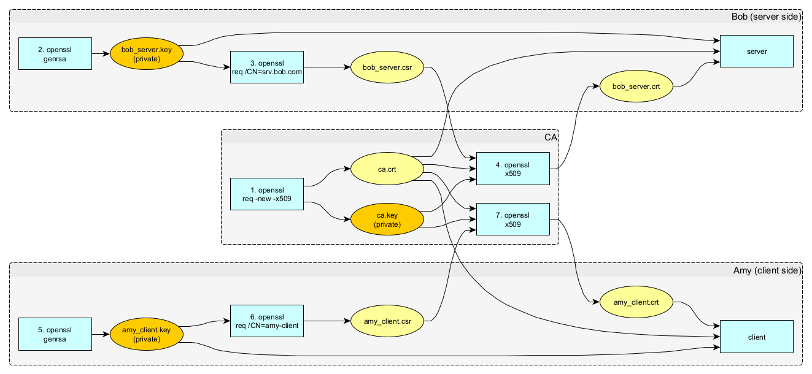
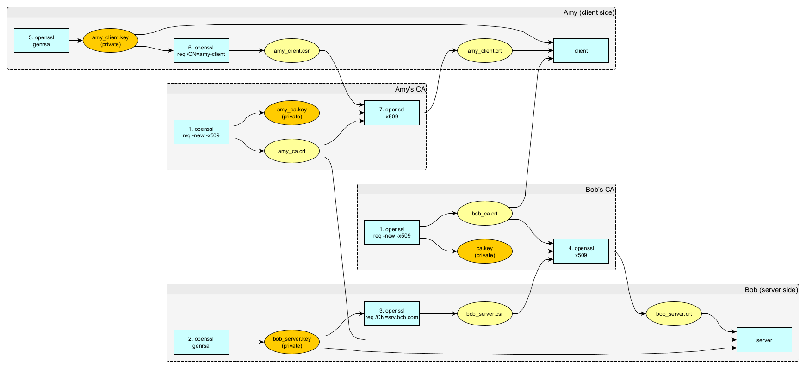

# Using MTLS

Client (Amy) accessing server (Bob) using MTLS.

The diagram below shows how the server and client certificates are created.



The CA (certification authority) is a third party responsible for signing the certificates with a trusted root
certificate. But it is common to use a CA that belongs to one of the two parties (Amy ou Bob).

It is also possible that Amy uses one CA and Bob chooses another (it will be explained later).

Note that the procedure for creating the server certificate is the same as for the client certificate. The only
difference is in the common name used in the certificate subject:

- The CN of the server must be the name that the Amy uses to access Bob.
- The CN of the client can be anything, although the server can use it to do some additional validation.

## 1. [CA] creation of a self-signed root CA X.509 certificate

```bash
openssl req \
  -new \
  -x509 \
  -nodes \
  -days 365 \
  -subj '/CN=my-ca' \
  -keyout ca.key \
  -out ca.crt
```

## 2. [Bob, server side] create the server’s key

```bash
openssl genrsa -out bob_server.key 2048
```

## 3. [Bob, server side] request the server’s certificate

The Common Name in the subject should reflect the server name that will be used by clients, like `srv.bob.com`. For
testing purposes, we will simply assume `localhost`.

```bash
openssl req \
  -new \
  -key bob_server.key \
  -subj '/CN=localhost' \
  -out bob_server.csr
```

The Certificate Signing Request (csr file) generated in this step must be sent to the CA to proceed with the creation of
the certificate.

## 4. [CA, on behalf of Bob] Using the CSR, the CA creates the signed server certificate:

```bash
openssl x509 \
  -req \
  -in bob_server.csr \
  -CA ca.crt \
  -CAkey ca.key \
  -CAcreateserial \
  -days 365 \
  -out bob_server.crt
```

The certificate (crt file) is sent to Bob.

## 5. [Amy, client side] create the clients’s key

```bash
openssl genrsa -out amy_client.key 2048
```

## 6. [Amy, client side] request the server’s certificate

```bash
openssl req \
  -new \
  -key amy_client.key \
  -subj '/CN=amy-client' \
  -out amy_client.csr
```

The Certificate Signing Request (csr file) generated in this step must be sent to the CA to proceed with the creation of
the certificate.

## 7. [CA, on behalf of Amy] Using the CSR, the CA creates the signed client certificate:

```bash
openssl x509 \
  -req \
  -in amy_client.csr \
  -CA ca.crt \
  -CAkey ca.key \
  -CAcreateserial \
  -days 365 \
  -out amy_client.crt
```

The certificate (crt file) is sent to Amy.

# Test

## Start Bob's server:

Start node application:

```bash
node app_bob.js
```

If you want to allow only clients with the more secure TLS v1.3:

```bash
node --tls-min-v1.3 app_bob.js
```

## Execute Amy's client:

```bash
curl \
  --cacert ca.crt \
  --key amy_client.key \
  --cert amy_client.crt \
  https://localhost:3000
```

# Using distinct CAs

If Amy and Bob are using distinct CAs, they need to know each other root certificates.

Assume that Amy's and Bob's CAs have certificates `amy_ca.crt` and `bob_ca.crt`, respectively.

So, Bob must load the certificate used by Amy:

```json
const options = {
    ca: fs.readFileSync('amy_ca.crt'),
```

And Amy's client need to know the certificate used by Bob:

```bash
curl \
  --cacert bob_ca.crt \
```



These are complete instructions to create this scenario:

Bob (server side):

```bash
openssl req \
  -new \
  -x509 \
  -nodes \
  -days 365 \
  -subj '/CN=bob-ca' \
  -keyout bob_ca.key \
  -out bob_ca.crt

openssl genrsa -out bob_server.key 2048

openssl req \
  -new \
  -key bob_server.key \
  -subj '/CN=localhost' \
  -out bob_server.csr

openssl x509 \
  -req \
  -in bob_server.csr \
  -CA bob_ca.crt \
  -CAkey bob_ca.key \
  -CAcreateserial \
  -days 365 \
  -out bob_server.crt
```

Amy (client side):

```bash
openssl req \
  -new \
  -x509 \
  -nodes \
  -days 365 \
  -subj '/CN=amy-ca' \
  -keyout amy_ca.key \
  -out amy_ca.crt

openssl genrsa -out amy_client.key 2048

openssl req \
  -new \
  -key amy_client.key \
  -subj '/CN=amy-client' \
  -out amy_client.csr

openssl x509 \
  -req \
  -in amy_client.csr \
  -CA amy_ca.crt \
  -CAkey amy_ca.key \
  -CAcreateserial \
  -days 365 \
  -out amy_client.crt
```
